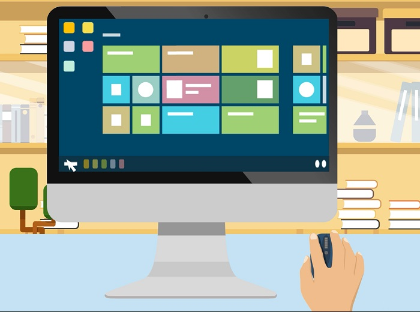

In this lesson, you will learn how to operate a computer to perform basic tasks.

**By the end of this lesson, you will be able to:**

*   Describe the role of an operating system.
*   Navigate the Windows 10 operating system.
*   Organize files and folders in Windows 10.
*   Use the right-click to access system features.
*   Customize your operating system desktop.

Keep the following **guiding questions** in mind as you complete this lesson. See if you can answer them on your own at the end of the lesson:

1.  What is an operating system? Provide an example of a popular operating system.
2.  What are the primary parts of the operating system that you use to get things done?
3.  How do files and folders help you organize things on your computer?
4.  What does the right-click feature of an operating system help you do?
5.  What parts of your operating system can you customize to your preferences?

##        quiz    title: Check your knowledge (** markdown type **)(can be ignored )
this is still the part of quiz title 
this is still the part of quiz title 
---
what is an operation system?
>>An operating system is the most important ___________ on the computer.<<

( ) hardware component {{incorrect choice}}
(x) software {{correct choice}}
( ) peripheral device {{incorrect choice}}

---

>>What happens when you select the Minimize (-) button on / at the top of an application window?<<

( ) The window is closed {{incorrect choice}}
(x) The window is temporarily hidden {{correct choice}}
( ) The window is opened in full screen {{incorrect choice}}
( ) The window is moved to the side of the screen {{incorrect choice}}