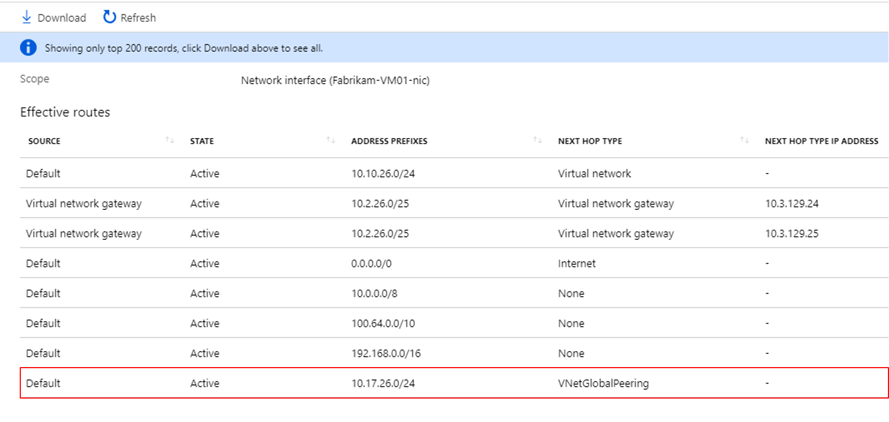

Organizations with large scale operations will often need to create connections between different parts of their virtual network infrastructure. Virtual network peering enables you to seamlessly connect separate VNets with optimal network performance, whether they are in the same Azure region (VNet peering) or in different regions (Global VNet peering). Network traffic between peered virtual networks is private. The virtual networks appear as one for connectivity purposes. The traffic between virtual machines in peered virtual networks uses the Microsoft backbone infrastructure, and no public Internet, gateways, or encryption is required in the communication between the virtual networks.

The benefits of using virtual network peering, whether local or global, include:

-	A low-latency, high-bandwidth connection between resources in different virtual networks.
-	The ability to apply network security groups in either virtual network to block access to other virtual networks or subnets. 
-	The ability to transfer data between virtual networks across Azure subscriptions, Azure Active Directory tenants, deployment models, and Azure regions.
-	The ability to peer virtual networks created through the Azure Resource Manager.
-	The ability to peer a virtual network created through Resource Manager to one created through the classic deployment model. 
-	No downtime to resources in either virtual network is required when creating the peering, or after the peering is created.

The following diagram shows a scenario where resources on the Contoso VNet and resources on the Fabrikam VNet need to communicate. The Contoso subscription in the US West region, is connected to the Fabrikam subscription in the US West region.

The routing tables show the routes known to the resources in each subscription. The following routing table shows the routes known to Contoso, with the final entry being the Global VNet peering entry to the Fabrikam 10.10.26.0/24 subnet.

The following routing table shows the routes known to Fabrikam. Again, the final entry is the Global VNet peering entry, this time to the Contoso 10.1.26.0/25 subnet.

##Use service chaining to direct traffic to a gateway

Suppose you want to direct traffic from the Contoso VNet to a specific network virtual appliance (NVA). Create user-defined routes to direct traffic from the Contoso VNet to the NVA in the Fabrikam VNet. This technique is known as service chaining. 

To enable service chaining, add user-defined routes pointing to virtual machines in the peered virtual network as the next hop IP address. User-defined routes can also point to virtual network gateways.

Azure virtual networks can be deployed in a hub-and-spoke topology, with the hub VNet acting as a central point of connectivity to all the spoke VNets. The hub virtual network hosts infrastructure components such as an NVA, virtual machines and a VPN gateway. All the spoke virtual networks peer with the hub virtual network. Traffic flows through network virtual appliances or VPN gateways in the hub virtual network. The benefits of using a hub and spoke configuration include cost savings, overcoming subscription limits, and workload isolation.

The following diagram shows a scenario in which hub VNet hosts a VPN gateway that manages traffic to the on-premises network, enabling controlled communication between the on-premises network and the peered Azure VNets.

