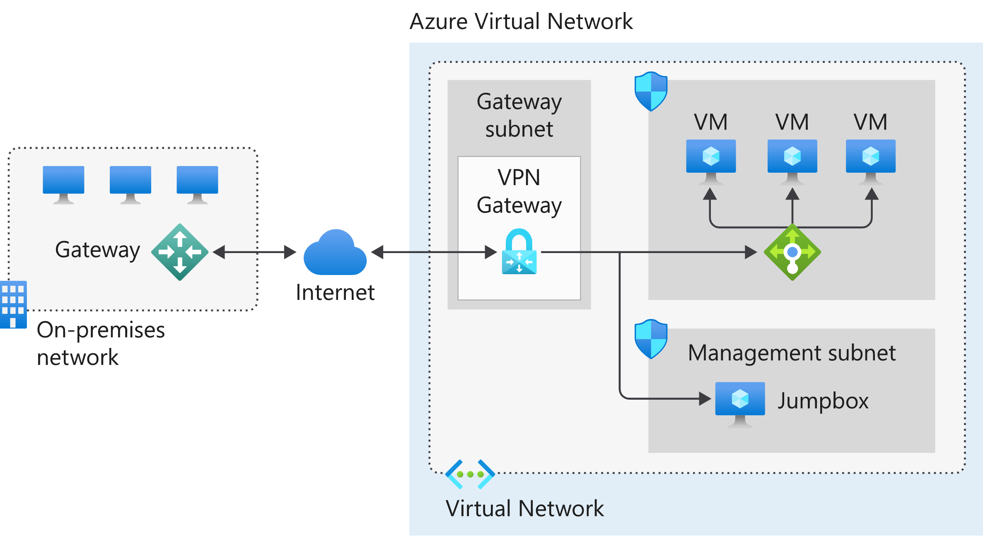

A site-to-site (S2S) VPN gateway connection lets you create a secure connection to your virtual network from another virtual network or a physical network. The following diagram illustrates how you would connect an on-premises network to the Azure platform. The internet connection uses an IPsec VPN tunnel.

In the diagram:

- The on-premises network represents your on-premises Active Directory and any data or resources.

- The gateway is responsible for sending encrypted traffic to a virtual IP address when it uses a public connection.

- The Azure virtual network holds all your cloud applications and any Azure VPN gateway components.

- An Azure VPN gateway provides the encrypted link between the Azure virtual network and your on-premises network. An Azure VPN gateway is made up of these elements:

  - Virtual network gateway

  - Local network gateway

  - Connection

  - Gateway subnet

- Cloud applications are the ones you've made available through Azure.

- An internal load balancer, located in the front end, routes cloud traffic to the correct cloud-based application or resource.

Using this architecture offers several benefits, including:

- Configuration and maintenance are simplified.

- Having a VPN gateway helps ensure that all data and traffic are encrypted between the on-premises gateway and the Azure gateway.

- The architecture can be scaled and extended to meet your organization's networking needs.

This architecture isn't applicable in all situations because it uses an existing internet connection as the link between the two gateway points. Bandwidth constraints can cause latency issues that result from reuse of the existing infrastructure.