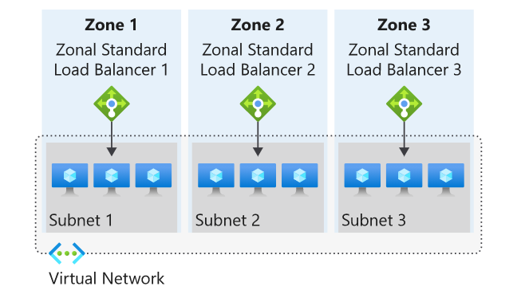
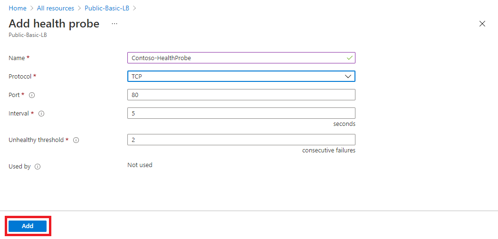
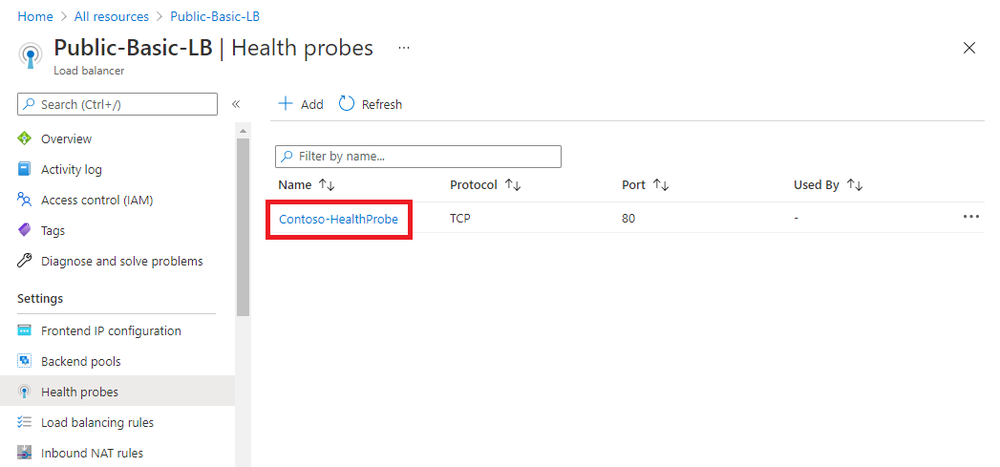
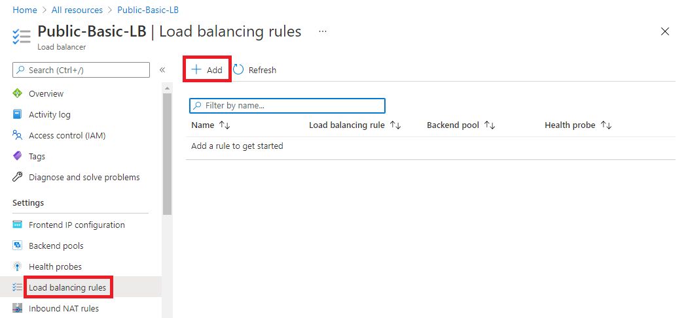
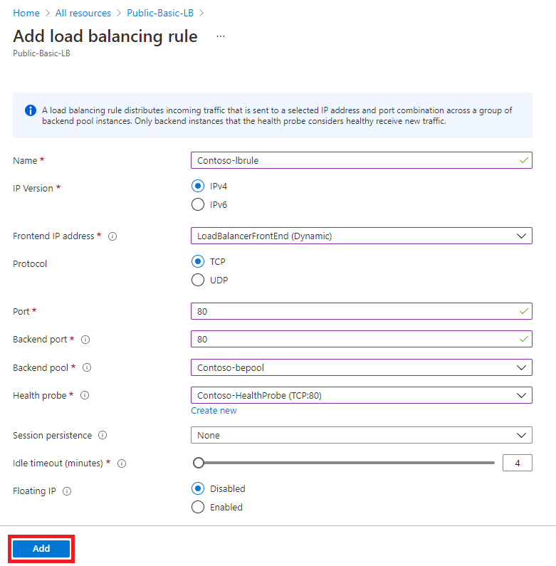
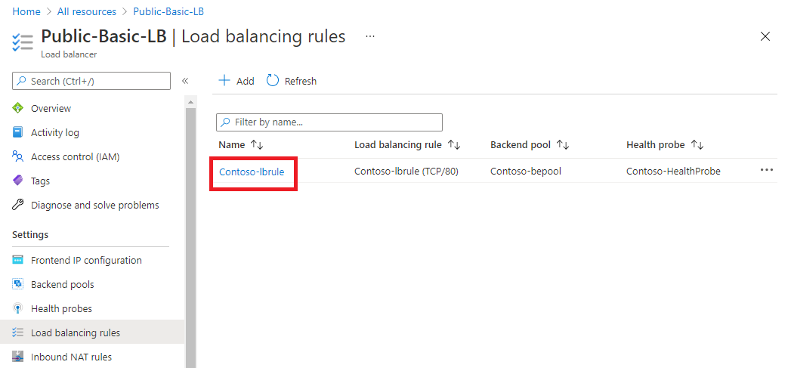

**Azure Load Balancer** operates at layer 4 of the Open Systems Interconnection (OSI) model. It's the single point of contact for clients. Azure Load Balancer distributes inbound flows that arrive at the load balancer's front end to backend pool instances. These flows are according to configured load-balancing rules and health probes. The backend pool instances can be Azure Virtual Machines or instances in a virtual machine scale set.

## Choosing a Load Balancer Type

Load balancers can be public (a.k.a. external) or internal (a.k.a. private).

A [**public load balancer**](https://docs.microsoft.com/en-us/azure/load-balancer/components) can provide outbound connections for virtual machines (VMs) inside your virtual network. These connections are accomplished by translating their private IP addresses to public IP addresses. External load balancers are used to distribute client traffic from the internet across your VMs. That internet traffic might come from web browsers, module apps, or other sources.

An [**internal load balancer**](https://docs.microsoft.com/en-us/azure/load-balancer/components) is used where private IPs are needed at the frontend only. Internal load balancers are used to load balance traffic from internal Azure resources to other Azure resources inside a virtual network. A load balancer frontend can also be accessed from an on-premises network in a hybrid scenario.

 

## Azure Load Balancer and availability zones 

Azure services that support availability zones fall into three categories:

- Zonal services: Resources can be pinned to a specific zone. For example, virtual machines, managed disks, or standard IP addresses can be pinned to a specific zone, which allows for increased resilience by having one or more instances of resources spread across zones.

- Zone-redundant services: Resources are replicated or distributed across zones automatically. Azure replicates the data across three zones so that a zone failure does not impact its availability. 

- Non-regional services: Services are always available from Azure geographies and are resilient to zone-wide outages as well as region-wide outages.

**Availability zones can be used by Standard load balancers but are not supported for use in Basic load balancers (see next section).**
Azure Load Balancer supports availability zones scenarios. You can use Standard Load Balancer to increase availability throughout your scenario by aligning resources with, and distribution across zones. Review this document to understand these concepts and fundamental scenario design guidance

A Load Balancer can either be zone redundant, zonal, or non-zonal. To configure the zone related properties (mentioned above) for your load balancer, select the appropriate type of frontend needed.

###Zone redundant

###Zonal

## Selecting an Azure Load Balancer SKU

Two SKUs are available when you create a load balancer in Azure: Basic load balancers and Standard load balancers. These SKUs differ in terms of their scenario scope and scale, features, and cost. Any scenario that is possible with the Basic load balancer can also be created with the Standard load balancer.

To compare and understand the differences, review the table below.

| *Features*                     | **Basic Load Balancer SKU**                                  | **Standard Load Balancer SKU**                               |
| ------------------------------ | ------------------------------------------------------------ | ------------------------------------------------------------ |
| **Backend pool size**          | Supports up to 300 instances                                 | Supports up to 1,000 instances                               |
| **Backend pool endpoints**     | Virtual machines in a single availability  set or virtual machine scale set | Any virtual machines or virtual machine  scale sets in a single virtual network |
| **Health probes**              | TCP, HTTP  Does not support secure HTTP (HTTPS)              | TCP, HTTP, HTTPS                                             |
| **Health probe down behavior** | TCP connections stay alive on an instance  probe down. All TCP connections end when all probes are down | TCP connections stay alive on an instance  probe down **and** on all probes  down |
| **Availability Sets**          | Supported                                                    | Supported                                                    |
| **Availability Zones**         | N/A                                                          | Zone-redundant and zonal frontends for  inbound and outbound traffic |
| **Diagnostics**                | Azure Monitor logs                                           | Azure Monitor multi-dimensional metrics                      |
| **HA ports**                   | N/A                                                          | Available for Internal Load Balancer                         |
| **Secure by default**          | Open by default. Network security group  optional            | Closed to inbound flows unless allowed by  a network security group. Internal traffic from the virtual network to the  internal load balancer is allowed |
| **Outbound Rules**             | N/A                                                          | Declarative outbound NAT configuration                       |
| **TCP Reset on Idle**          | N/A                                                          | Available on any rule                                        |
| **Multiple front ends**        | Inbound only                                                 | Inbound and outbound                                         |
| **Management Operations**      | 60-90+ seconds typical                                       | Most operations < 30 seconds                                 |
| **Service Level Agreement**    | N/A                                                          | 99.99% for 2 or more VMs                                     |

**Microsoft recommends Standard load balancer. Standalone VMs, availability sets, and virtual machine scale sets can be connected to only one SKU, never both. Load balancer and the public IP address SKU must match when you use them with public IP addresses. **

**SKUs aren't mutable; therefore, you cannot change the SKU of an existing resource. **

## Creating and Configuring an Azure Load Balancer

There are several tasks you need to perform to successfully create and configure an Azure Load Balancer. 

### Create the load balancer

In this example, we are looking at the tasks required to create and configure a **Public** (external) **load balancer** in a **Basic SKU**. The first task is to create the load balancer itself.

From the Azure portal home page, select **Create a resource**.

On the Create a resource page, you can either browse to try and find the resource type you want to create or enter your search criteria in the search box and press ENTER. For example, type **Load Balancer**. To narrow down the search results, you can use the filters to the right of the search box. For example, select **Publisher Type**, and then choose **Microsoft**. 

Then choose the **Load Balancer** resource from Microsoft.

On the Load balancer page, choose **Create** to start the process.

On the **Create load balancer** page, you must supply the following required information:

- **Subscription** - select the Azure subscription that you want to create your new load balancer resource in.

- **Resource group** - here you can select an existing resource group or create a new one.

- **Name** - provide a unique name for the instance.

- **Region** - select the region where the virtual machines were created.

- **Type** - this is where you select whether your load balancer is going to be **Internal** (private) or **Public** (external). If you choose **Internal**, you will need to specify a virtual network and IP address assignment, but if you choose **Public**, you will need to specify several Public IP address details. 

- **SKU** - here you can select either the **Standard** SKU or the **Basic** SKU (for production workloads you should choose **Standard**, but for testing and evaluation and training purposes, you could choose **Basic**, but you will not get all the possible load balancer features). Depending on which SKU you select here, the remaining configuration options will differ slightly.

- **Tier** - this is where you select whether your load balancer is balancing within a region (**Regional**) or across regions (**Global**) - If you select the **Basic** SKU above, this setting is greyed out.

- **Public IP address** - here you specify whether to create a new public IP address for your public-facing front-end, or use an existing one, and you also specify a name for your public IP address, and whether to use a dynamic or statically assigned IP address. You can optionally also assign an IPv6 address to your load balancer in addition to the default IPv4 one.

After you click **Review + Create**, the configuration settings for the new load balancer resource will be validated, and then you can click **Create** to start creating it. 

The resource will start to be deployed.

When it completes, you can click **Go to resource** to view the new load balancer resource in the portal.

.

 

### Add a backend pool

The next task is to create a backend pool in the load balancer and then add your virtual machines to it.

From the Azure portal home page, select **All resources**.

Select your load balancer from the list.

Under the **Settings** section choose **Backend pools**, and then **Add** to add a pool.

You need to enter the following information on the **Add backend pool** page.

| **Field**       | **Information**                                              |
| --------------- | ------------------------------------------------------------ |
| Name            | Enter a unique name for the backend pool.                    |
| Virtual network | Specify the name of the virtual network where the resources are located that you will be adding to the backend pool. |
| Associated to   | You need to associate the backend pool with one or more virtual machines, or to a virtual machine scale set. |
| IP Version      | Select either **IPv4** or **IPv6**.                          |

You could add existing virtual machines to the backend pool at this point, or you can create and add them later. You then click **Add** to add the backend pool.

### Add virtual machines to the backend pool

The next task is to add the virtual machines to the existing back-end pool.

On the **Backend pools** page, select the backend pool from the list.

You need to enter the following information to add the virtual machine to the backend pool.

| **Field**       | **Information**                                              |
| --------------- | ------------------------------------------------------------ |
| Virtual network | Specify the name of the virtual network where the resources are located that you will be adding to the backend pool. |
| Associated to   | You need to associate the backend pool with one or more virtual machines, or to a virtual machine scale set. |
| IP Version      | Select either **IPv4** or **IPv6**.                          |

Then under the **Virtual machines** section, click **Add**.

Select the virtual machines you want to add to the backend pool and click **Add**.

Then click **Save** to add them to the backend pool.

 

### Add health probes

The next task is to create a health probe to monitor the virtual machines in the back-end pool.

On the **Backend pools** page of the load balancer, under **Settings**, select **Health probes**, and then click **Add**.

You need to enter the following information on the **Add health probe** page.

| **Field**           | **Information**                                              |
| ------------------- | ------------------------------------------------------------ |
| Name                | Enter a unique name for the health probe.                    |
| Protocol            | Select either **TCP** or **HTTP**.                           |
| Port                | Specify the destination port number for the health signal. The default is port **80**. |
| Interval            | Specify the interval time in seconds between probe attempts. The default is **5** seconds. |
| Unhealthy threshold | Specify the number of consecutive probe failures that must occur before a virtual machine is considered to be in an unhealthy state. The default is **2** failures. |

You then click **Add** to add the health probe.

 

### Add a load balancer rule

The last task is to create a load balancing rule for the load balancer. A load balancing rule distributes incoming traffic that is sent to a selected IP address and port combination across a group of backend pool instances. Only backend instances that the health probe considers healthy receive new traffic.

On the **Health probes** page of the load balancer, under **Settings**, select **Load balancing rules**, and then click **Add**.

You need to enter the following information on the **Add load balancing rule** page.

| **Field**              | **Information**                                              |
| ---------------------- | ------------------------------------------------------------ |
| Name                   | Enter a unique name for the load  balancing rule.            |
| IP Version             | Select either **IPv4** or **IPv6**.                          |
| Frontend IP address    | Select the existing public-facing IP  address of the load balancer. |
| Protocol               | Select either the **TCP** or **UDP** protocol.               |
| Port                   | Specify the port number for the load  balancing rule. The default is port **80**. |
| Backend port           | You can choose to route traffic to the  virtual machine in the backend pool using a different port than the one that  clients use by default to communicate with the load balancer (port 80). |
| Backend pool           | Select an existing backend pool.  The virtual machines in this backend pool  will be the target for the load balanced traffic of this rule. |
| Health probe           | Select an existing health probe or create  a new one.   The load balancing rule uses the health  probe to determine which virtual machines in the backend pool are healthy and  therefore can receive load balanced traffic. |
| Session persistence    | You can choose **None**, or **Client IP**, or **Client IP and protocol**.   Session persistence specifies that  traffic from a client should be handled by the same virtual machine in the  backend pool for the duration of a session. **None**  specifies that successive requests from the same client may be handled by any  virtual machine. **Client IP** specifies  that successive requests from the same client IP address will be handled by  the same virtual machine. **Client IP and protocol**  specifies that successive requests from the same client IP address and  protocol combination will be handled by the same virtual machine. |
| Idle timeout (minutes) | Specify the time to keep a TCP or HTTP  connection open without relying on clients to send *keep-alive* messages.   The default idle timeout is **4** minutes, which is also the minimum setting. The  maximum setting is 30 minutes. |
| Floating IP            | Choose between **Disabled** or **Enabled**.  With Floating IP set to **Disabled**, Azure exposes a traditional load  balancing IP address mapping scheme for ease of use (the VM instances' IP).   With Floating IP set to **Enabled**, it changes the IP address mapping to the  Frontend IP of the load balancer to allow for additional flexibility. |

You then click **Add** to add the load balancing rule.

 

### Test the load balancer

Having completed the various tasks to create and configure your public load balancer and its components, you should then test your configuration to ensure it works successfully. The simplest way to do this is to copy the **Public IP Address** from the public load balancer resource you created and paste it into a web browser. You should receive a response from one of the VMs in your load balancer. You could then stop whichever VM randomly responds, and once that VM has stopped, refresh the browser page to verify that you receive a response from the other VM in the load balancer instead.

 

## Quiz title: Check your knowledge 

## Multiple Choice 

What is an Availability Zone?

(x) An availability zone is a physical location that offers groups of one or more datacenters that have independent power, cooling, and networking.{{Correct, An availability zone is a unique physical location within an Azure region, offering groups of one or more datacenters that have independent power, cooling, and networking.}} 

( ) An availability zone is a logical grouping that you use to isolate virtual machine resources from each other when they're deployed.{{Incorrect, An availability set is a logical grouping that you use to isolate virtual machine resources from each other when they're deployed.}} 

( )  An availability zone is a logical grouping of multiple data centers which shares power and storage with other zones.{{Incorrect, An availability zone is a unique physical location with groups of one or more datacenters that have independent power, cooling, and networking.}}

## Multiple Choice 

You are deploying a new Azure Load Balancer that must support outbound traffic rules. Which SKU should you choose?

(x) Standard{{Correct, Standard SKU supports outbound rules through declarative outbound NAT configuration.}} 

( ) Basic{{Incorrect, Basic SKU does not support outbound rules.}} 

( )  Either Standard or Basic{{Incorrect, Basic SKU does not support outbound rules.}}